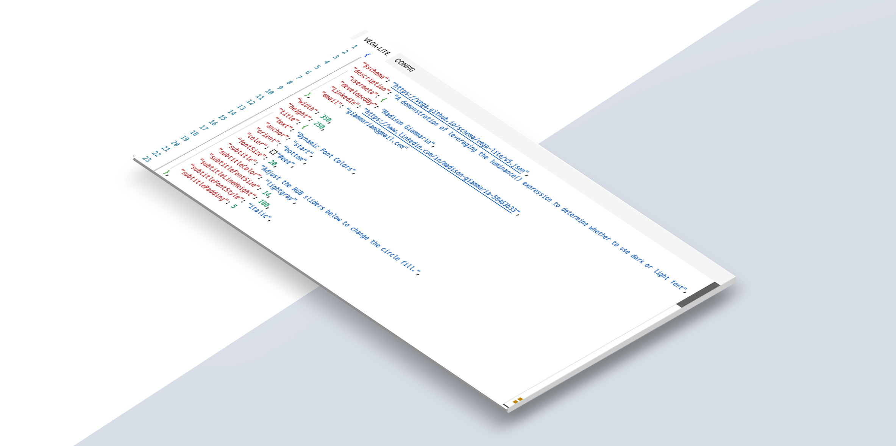
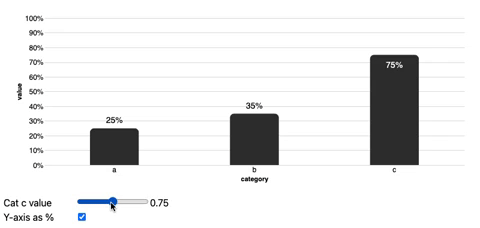
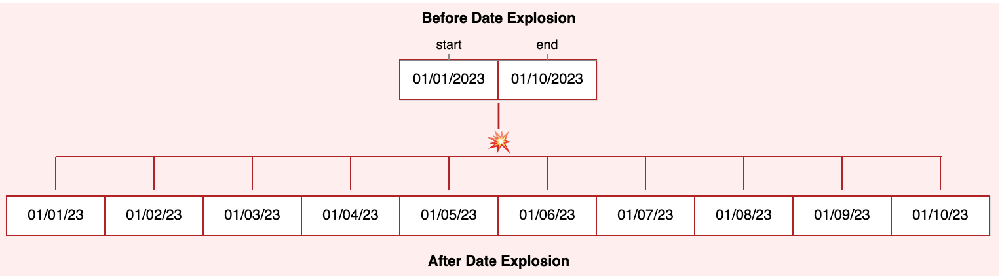

# Vega-Lite-Techniques
This is a growing compilation of some of my favorite visual techniques in Vega-Lite. My hope is that others can learn, critique, and gain inspiration from visiting this collection.

‎ 

‎
## Contextual Y-Axis Behavior
 
A technique to dynamically adjust the Y-axis behavior based on whether the measure is a percentage.  Comments are surrounding the <code>domainMax</code> property to make it easier to find in the JSON [specification](contextual-y-axis/visualization.vl.json).
|Vega-Lite|
|-|
|[Open the Chart with the Vega Editor](https://vega.github.io/editor/#/url/vega-lite/N4KABGBEAkDODGALApgWwIaQFxUQFzwAdYsB6UgN2QHN0A6agSz0QFcAjOxge1IRQyUa6ALQAbZskoBWOgCtY3AHaQANOAhQAJsgQAnRoTw8VOSAEEweZEiWMAjq2RXuYLQE8l6VI3joxYu5g6FpyrLB4VihgAJoi6AAejLBg7MiI6BQ8eqnosMhaYMpgAO4oLMg5FWCoyHmses7JwWCElfDISnjo1Mh0ahqQ4ZW13dhgoJrayFRi3G1aAELu45AAsiHJxQDijN4YBpjqU5AAMoxKANYFAJKmuATEZKQlr3QSVwUXdPDcqKQXUgYLRbJQiJj7dCHETSAAcABYAGwAZnYyORAxOaHQjDEqwhqAOe1QAAFqBhcT8-pANABfY5QEqMLQscYAdgADByGZBCCEQUpqOMAEzcwZZZAlcbASARPTca6rPB6dBKWB8xpdSD0wYa7ywcYAbQ0EBlXlqqxQjGo+DUUGQCUIelWTJZiAAVBy6MjpNqGaaTZpIObkKs-NZqNw9O4AMIANX8TkxUygFEToZwXrZ0n9QfYFy00sDJwuhFYeFWKsFodzJx89zFKaDGAS4wAjHQc8WgxFkIRxl6OW3a0GQ6sY+hIvAwGmxEnu7TAzqppMU8HvBmoO5zElYOZYAAFdqdbq9ZMnWdJnDKpwjyD5pSFnAy0vlsMoeCXdjcVuqKBjsw4kSZo8jAABSbUlw0ABdHktEnTBn0DdcLTMeDunyCtc0gS9dCNbsZXDGgoxWMwjlTdMBzoYVpGXFNCMnYjo1Wdg7RwyjM29WiRwYiMSLDSCpmgukeWVVVYAAMyjVB8JXbtID8MR4FYMRGNWdDWFQQ0AHIiMjaNtOgsAAF5TLAXTtLAAB+MA9JI+N0zAHANK07TcMM88gzyVZcJpKY6NNBT-GU1TrFWbdd33I89A6LoemcGztLaGKT3iyycG0pRNLSPRtLY7yzFYOwK0XCBYMGRpFDEKhpVlRTNxlUioALPtOh0LVaToyBVPcSpZM0Vc6yhS4iybCBIDwdw2hYqFPJOCTcTxMwAGJ0TWjER3GhaAgAeT5eBmCa4du3G349CUSoACVNnCAAVeZTmQCSK2fSAHSdS1kGtfBPToDkMQCtczouvRrpBO75ku76XomN7HWdMwrRtPBfv+wSU1KzRAcG5thtGsaJqmzcJodLCTqgdg8mQD5iZ8LQtDEGtycgKSugAZUYAAvTc23hTaoGsBIYZld6Ee0BCAAptPQ9AAH0OW0gBKQ0OWgnSiuYQyTLMpLjzi3pLJsqS9AwPAJZcnT3Ng8y-rApWnLAY3TfNydNMt9NDL-bSvWFCSlb9Zn3B2iSJMw-GxvteHVgQfxkClnrKnl2X3G0v8Lbcj3oMVsAAD4wCR-BSGFaywBENthU7B22zZSu-LGwH5sW8OCdF6P6vj9Ber0JOU7T13XKt7O84LvAi5L7Tlq5BWHYnkO-agcnMf8u9Ol+AUhSQiPICanGm0J6azEcVVjG6Ywav5rbGGpp8KLnJmI-GmPGebretD+HElA2VtN4frEo7QyW0sELyyVirNW2kNZ4C1qZYy5lkqxVPMgQ2YA2wOyygEOuv8G4EzsB0cYN5kAXyDPAVSqB+zXj0E4cmEBsEnGAgaHA6CxCLwXFBMqPJV7cHXs3SA38JjyUmgff8fwLj+DmlABa18wyMX0isO89DaqqTSGIcwgpn6ZmwXVWOtU+T0wuNQO4IMqKIlokubCO8BFE1WEfLozBJyMHPvJSRYgb7sTvuIrR6j+ER1IO6Px7o3DvwuF-XI+RCjFDKMgCoVRojOMKBA4qllmjwNSr0IoOQsqoBymAfx7pSDMzfhST+iQX5rlbgA7oUsZYgOVqrdWiSjIwLgXrRByDUGMJUniRe-NfG5L6f0gZ+St64M3AQhc8jdylPGko6mABRf+4tKlAO6DUsB9TNaNJ1ik-WSCS5O0nC7PAml3joGUV7W29scD7LNi5E5ZzzI+z9orcR41jCfhjNwIqwtqGRw+hU9AVTgEK1qeAyB0CtktLSiXNs7SwBMMwRjVh-kRKDF+EoBaG9YYKNeoUj+4wJL+HyH+CavhLgMMdoSwhUAZliAAGLKDwBzbm7ZhSdRALSIAA/view)|
|[Open the Vega-Lite Specification](contextual-y-axis/visualization.vl.json)|

‎ 

‎
## Date Explosion with Sequence() & Fold
 
A demonstration combining the sequence() expression and the fold transform to explode dates. The pertinent transforms are surrounded by comments in the [specification](date-explosion/visualization.vl.json).
|Vega-Lite|
|-|
|[Open the Chart with the Vega Editor](https://vega.github.io/editor/#/url/vega-lite/N4KABGBEAkDODGALApgWwIaQFxUQFzwAdYsB6UgN2QHN0A6agSz0QFcAjOxge1IRQyUa6ALQAbZskoAWOgCtY3AHaQANOCgATZAgBOjQnh4qckAIJhtqZbDy70R5WG4AzMIm4B3MOjDxuqOyMSg7Gzm4syGCwyACOrMhK8MgAFACUYMgAHoS6OrBh6EqaYJFgLtxiJXZFsBW6qH5FYOxR-oHByNXcmTli3NqWDjpqGpCsMQ3IeJg4oBAQkNpU-YRdAEIAnthQALLomoyKSmAA4ozoqBj6mOoLUAAywQDWXQCSJrgExGSknv90CRKV6HJR0dqkYKkDCHY4iJiXa4XEQAVgAHNIAGwAZnY2Oxo3ukDQ6EYYh2kARV3QN1QAAFqBgyeCApANABfO5QdjoeDPai6bisYoUgDELmQyEJUEINMusB2AG1gJAQqgpaZULAAArIXQAEXQ21UUGyuQpaMx0gADLbbZB2QBdLmQWCy+DBag7EQAJh9Ls0DlmYHmC1Vlw1UBm7DEUq5iwo6DECQVOGVkEkqApbzwaDAZjUUFsNLwFOtAEZSBXSD7rT6CSbiSLTNXy9aa3WCU6OS6ako6twGkqNBBSAAqCeTsAAFXs-fqGEcJwAyjNdHhYGAABJ6qKT-dj0gjkPHxbwJPwVhiYYUmLxRLJFJ4biG3MpQN4VioRUAcmL65-R00hNZ9X1SD8v1-RJNEAtIAGotV1A0jRNRC9UNTY0mlIl0FTLQb2PTljxVFxrwIRIlSWG9nSgXDKI-KVHSI+4VXPMRLzIyNxjweAADFB0Xd8HEgn8GMAk0fwAUlQUhJM0WTNh-LDGzo0wGIdY9xwPGc5wHBpQicABRYpNx3PIwAPScjwgZ0xmSJRc10HY7ASF0KH8JIHGHFjTyjXSF28+4FhIypNEo-9S0baDIBoyBVLARVIDwTY1kLKjcxi5igogUNssWTxgk0LwlRVbhCApQVPAAfSUL9WiclS8MgXQVCdeM8spQVWEIdhtjTDNcyzRtktSx1fIgLLspIslHIpCDvx-FrAIAXlW8sNOy2zsqbfxQS9OZxqgLIdlyjqXEYZAqgpEa40OxZ0CyI4TrusMjDwWMKXWZB6iiMCwEMvpuAKZRsLyxZr1aMQzCUagPpwa12rByBBwuhzrrK0Gkbe2NtQOPadjbF7Jo6xR1xOyBzsusLTButLB20Jy1J0ez8fZQ7iaJPqQwpi6rtMTM0oep6cFqsQxDZ7KOagArNBYcnbGQcqcAAdhRKXIBQRhqHweXcyVsBsWtdXr02PVAqmyBrmecnadMPJ4EiqBzrFsUXDdtLbEFV4KXOvJ2H0PkHSlnLLZpa25iSlKuNzLJS05U0kgGT0beyUsI8pvn8Iy9kc98sb7mJ07Fg-YMVUTZMRjTYAnWNo0zbTQ6i6C0PdHDk8waJW2o1TzGOpjtPubNRmoF-AAfH9VB-QBeDcAUp3AIdRGOp5GIgS41BGE0TQPsX7aky1z5IHs2ad+bioHOXRgAC9I1rE+iTPvAAHVkC1nWcDbBGXrPSpBx9xg-YDtbIm7M86EXak3dKpdIDlxTCVGui9IAm3rglRuL0W5tybttLuzVkAO17ttY6Ech5lgXl-I6PpybELtkUagqQfweXPHgKq2IqpZCUoqcsjoRA8mKDLFgKR6HKEYcw1hSlSEdzDJrbWA9rR0DtCiO+YZPbcG9qYX2yB-aMEDsAsGEsgr5wWIXXyO0k4w2ekjQh7cO48ypnNG8ii4qPTwpg5uRUmSfBcEmGIiji4BFJEoAAwj-YePMAFaOtj4qM4SL7Xx2D6BRZCkrhKCf0EJ6jNGB0iYg9AkM8KeLEN4xJKNEgDyShjLJ2NkAAE0diYk-hIxYlSKRmBcI5f6gNgYnDAvg5urgXAxAHiiImDjSYD2mrYtS9ioD02QXFBA0Fk56MlifSAXNxmZwGmgQWTidii3Fr5dWfDEC60VjsVW6spFv25grfWhta6m2HoqRu6CbZRwqrgx2PMXamHFO7RsyjVFO3-howBQcT4qitq81KNMe7xxMfjCO-dyYZ2plnKUOclkLAMRNDQY12RAA/view)|
|[Open the Vega-Lite Specification](date-explosion/visualization.vl.json)|

‎ 

‎
## Dynamic Data Labels with Monospace Fonts
<a>.
|Vega-Lite|
|-|
|[Open the Chart with the Vega Editor](https://vega.github.io/editor/#/url/vega-lite/N4KABGBEAkDODGALApgWwIaQFxUQFzwAdYsB6UgN2QHN0A6agSz0QFcAjOxge1IRQyUa6ALQAbZskoBWOgCtY3AHaQANOCgATZAgBOjQnh4qckACIBPJelSN46MWIthYibgHdSiRttJ5drEr2eFKE3LDMxmCa6HjoYGLo7MhisGDuzIhgqMrhhOjwyGAAZsp4aezosMiaYMpgLMiMumDoFOiMiexiRbD5hXRqGlCs1bqoyHHYYKAQEJDaVGLchDUAQhbTkACy6JqMikpgAOKMNhj6mOpzUAAyjEoA1jUAkia4BMRkpO6-dBJPGoPOjwbioUgPUgYfaHERMc7oS4iaQADgALAA2ADM7CxWKGN0gaA6Yi28NQFzOqAAAtQMJ0QWDIBoAL7XKBGPA9abASAhAAeeC2lmstngYFuSRSsDUUFgHE53NMAHVMmBtrk+gUigAxMoytkaSAZTQsaYAJgADJb2ZAUIxqPgeZBYCFCNMsZbDfMYlMcLM5pBRcgtr6qpMCYH2mJWDppgBtYZzXkAYViNG4uk2pgAgrLIAA1Byxi3Sb03GaQNMhaiZ7NQNb5osxkM4NFl9k3VPp2tZrYppvF1tgDFlpMAXVZtv86CUsFK4wTvPsYngrESIS2XRS+aqW6lpJZ49t+V0NhlOETXaT82DWxNZs7gfYD00PJvgYehFYQtMZ6U1Ahk+hK2O80g2h+8wYPy0zgRBFaBq6yDujgACMwGBnepgPogWDMghLJJuWEABoSWEcgEQTppGhLRiWOD+LGGGQC+Shvv6kBfj+WxIMg8CPOw3AwaoUDkXylHBMgeGETcxEzB+QY2MOkDbqSzF0cpAAq3hpAcrQJAeNHPq+zpcb+HLIIK+Ziap0lEU+vI2QeAAKez7AB+YabBcmOUp+7JGIGpKHk2qaHqShCiJkBeaYABK3CCXg3DqrkkA+QpTkBeFeAAMqMAAXkBCkxWAqFosxrHsfJCHzGZWz-oBRkgQ80wohhUHoDBOBYtI7Vym60zoZBol+aYpQRS4BVSfhFYyXMPmKRMWyVLoKbcMsuieUOWwAMQ4ua7CocUaUOYtymqQA+kgiIFCEugXThF2oOuRiEBIyCbVFlmEJtphonQ0ioaQqHmmlYDkA07jIOgjwNDpYBKKwqDJC0lTVLU9SNNkmr9EU414Box5GsgQTcO51DOvWvJ4BYqxbMFoEOPmxSMCkVVVj2dZpeWKnoBYH0JkmpGYaNUArU1UAXI8741RytPKeLfWQCzjjOt9v1i4ia0bWlH5yfMJOguTMs1ZAXXVbLct06YACOrCzpysSMFQEuEizbNbM2JZ9fMCAOMOvKaGCHRKLs5uodac0EXr9lCxlou8wFEvibO86ZqgguyxDK5rhuRRY6p2SIrDDgOkoEwRSJKwFMwFhV8UxTVHgYBozUdRHMwaQRIVrRsXDvS4607SdEkPTDcLCGQDn67UaYfs9AAFAA5PyS8ib6SPxkvXvIEv44AJRgAAfAAvOkPgsKQ5pgAA-GAS-6I6eBL2AOBLz0xTP67gZ7qYpfUCoYa+tkzDXmNPPOoZYibyXv-JQe8wAn0QffD+z9b7n1NFkEQLgVzIGXqvdeUDUBbx3nvfeIgF7mgAFSqVcpocmh8cDz1wSvNe0RCHEKHKQ8hWJqEuTcg8ag+9v7zF-lAVSOZh5dB6KqDBM0CJ9QnhWKeDhc6zzEQebKeUe6UIMgFK6iAbrwDug9C+iAnovQMO9FoOiegARYAvDeRD34HlIcIqAojE4pBzEY+2YgZFmiAQo0BUBwFqPEoESSYAAA+US2F4GgeIyRo9kD+MQPAo+cSEkHm8fEhwqT4F31Qq-MAlo3GQA8apAA8v0WucjZpBMtiElRM9NymAcewmBEgAHwMQWfd+yBP4v0KcUkQ5pD42L4XQgRZSKkHjMDBQJ49gnKNXC05Sjit6wJ6Ug-pgy0FLx2taS0L8cAxkZkEXBK1taZkPqfEpAN9mHOtCc++O0G7FCXjMi8UB8bXM2kAj8RNJ5SxNpPGm1sLJWT6uQdAhA3rOCxhpNI2g7qgTbg8fuDR-xp3GGkJI3AqDDXKV094vJ1aQPiU4rZ44TpEtBDrDi5LTAbKXr89amY960tlmbNW-IfpbCYXg1hLKSEHy5abTQ5syV8o1gsDpql5mcuAfMCQthzLSv5cy+V2SkndBSaYpVSt8a8s1eogKQUQqFDCmUcVk98ZaIDkSGV-kUiaKmrapRSV1qvRNbKxiVEQhgAAGRBsyU4xJJJkn5PHGAAAPGGre4ifF5INTGu+LLVLwJwIjVWyqoDV3gLUxlzqtWUsTQeapNcaZKr1sxQ2ZNpkcQFOqvk8t6ZggeEzKK7sxDs1UtzIihNbSgiUCzCm-okzlP5AcZ0Qd6TvGKA4aoUUjD8W+Yu1IyAorUH0FVDd1Q5JToOAATWdDQ-hHkcAdknYqAOCl5TsFvW6wqg1ZC9QUsa4tprPGBRxqFbKHr5j2vdTgc077J6ziQJmAVcRdCRQ-WUHKNMlRQGYKXeAyduANybh6S0g6IA8woKzdwoL+q6G4M8X1y0tbss2oe105HniVsLTTaYlo6BgafMrTopJTAzjnKeEmQopxGkqPxHd3BAjs341qXQQnmQsiAA/view)|
|[Open the Vega-Lite Specification](dynamic-data-labels/artifacts/visualization.vl.json)|

‎ 

‎
## Luminance() to Determine Font Color
 
You can leverage the luminance() expression to determine whether to use dark or light font. Comments are surrounding the luminance expression to make it easier to find in the JSON [specification](luminance/visualization.vl.json).
<Description>
|Vega-Lite|
|-|
|[Open the Chart with the Vega Editor](https://vega.github.io/editor/#/url/vega-lite/N4KABGBEAkDODGALApgWwIaQFxUQFzwAdYsB6UgN2QHN0A6agSz0QFcAjOxge1IRQyUa6ALQAbZskoBWOgCtY3AHaQANOCgATZAgBOjQnh4qckAIJhtqZbDy70R5WG4AzMGORV7TJdTAtkd1ZURiV0JXhkAAoASjBkAA9CXR1YY39uS2Q8ZF0QpUCAdxQA3QywVlhAzXRdAGtnMolqfDAXZTw1DQhIStzUbMwcUAge7SoxbkJkTQAhAE9sKABZdE1GRSUwAHFGdFQMfUx1UagAGVC6mYBJE1wCYjJSQpe6CSUr9aU6eG5UUlCpAw602IiY+0OexE0gAHAAWABsAGZ2EikV1TpA0OhGGIlpBwQdantUAABagYXE-P6QDQAXxOUEKjE0LCWSOkAAZGZAUIwWp0cAAmLk8ox4DxLEajSA5BKCqAAEXmYRC8DAADEOmAAMLcSa6WAYmXhJDcXT42y1TqMnrmxjIJQKyDsbgEGm2qC-A34gDEyADxp67SdAGVGAAvZBLIXc7pQWAccWS0xmTRySp4fwoMAAJW2szAsAk2kNYHYyEmhXKSHC1ECATA8EYungHjauLEdCDCaTzA8ep9pma+Go9kWnsgifYyeQWrDkejOAAjHDJ9PZxcCgAJZD8-BLZecuOYjf9ucdUN4eYpqDMdASeA9qd9iXIAAKay+1CW0npPPYdB4DqMduFYJRNClLEkgtUwAHJfWPTk4MgBkNEgQhan2I0cAAbXjaVMVVJcoAtT0egoB9WBI6QAHZyKgdhQkg4ZIFCQhWGdexfGjVQoHyJZuX49AEhjaQET4qcckIQ9JOI-Fc1Q+M0NOQiZXk0wfwYyBKLEajDzhJFtKYiCoPYzj8W4+s1H40JBMkjBROFcTJNsZAZJXOT9hIyBtiU04VNGNSeg0xiewoqiSIAThhYzmLMpQOK4uteNsu4hMgRyxIkhNpNkqBQsgWZ-NGQKIGASBCt0ah2Bs6Dkksmqol0VRqFUdgYhKgBdHkxHQeZciWfDVPjELvPxZtWw8AB9QDgNA8DNGXcKtAcIYwAq3TqJwsBcOAOkurKmVDjqKVRpla9pnxWonwYnp7HWSooMSBrTHyKJmVZRBSCFOhl1UPkBR+v7OqOzEnI2+rYKZFkWB+1C7qgRZWJe6HeT3IGhQR87g07P0XAJlaelsXRuCuZ6YMa2qwZlEmyeQAB1WHECWOET1OWm7HpgB5TDm2vCnXqgTk6DhaQSoC5TPWCgrxtMSa22QWagJA0nFqx7SajwdbNsina9oOmnMtqU7hhxqBLp8m6idItZGCelHKbe0IPuZ4GjMB-B3dBxHIAhirUfxT64axmmemRyHA9MT28HhsOoBcPHHaFyBqup326fJ5O0bT7GOc50mriZr7WfZ-OpML5BeaA5gI4Dp3hdF8W6XOluAul87Krlr0W0V6a+orMQjU1taoK2nQhv2w7tJOs7856S38TlG1zdlRIFRlzEo6gXC4PzWYojggBqMAyiPuDVDgsAT78E+L6vk-2GvsA4JiC+X7OYJQlNQIAF4X+fu0PIDgohtn2IQKIel8g-2ajVGIfEhLLngS-EWSIXCvz4pAr+YQIjRDTnEAAfP-EWYswAAH4X6KhNlfHAcELgClfs-K+848BwS6rSeeYB46QAfPyO4kBIhOkGr7QCVR3g+VdO6VANtIAhjwOGKMMZfrSF9v7KGQc3ah19nXdR0cMZey0ebUgAAqUxxigjQNwbENo5obFOg7GIMQYAUApDAGY4xpBV6J0cYLNGUDv5WPwWAIhYASHSHIS-X0Qpok0MiQGZAKE27zxMe41JaT0kZMyZ4-OSSIBJK6iAOkQA/view)|
|[Open the Vega-Lite Specification](luminance/visualization.vl.json)|

<!--
‎ 

‎
##

<Description>
|Vega-Lite|
|-|
|[Open the Chart with the Vega Editor]()|
|[Open the Vega-Lite Specification]()|

-->