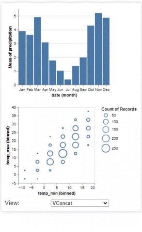
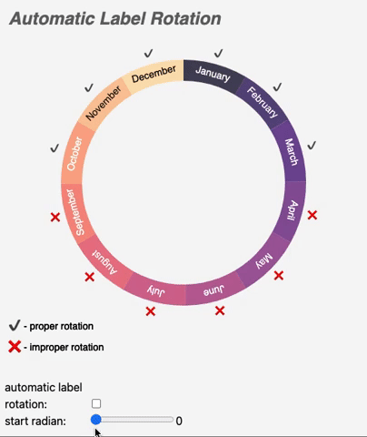
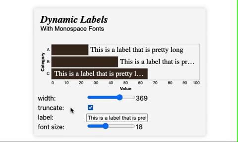
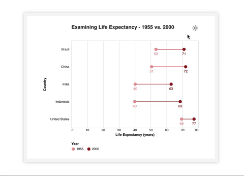
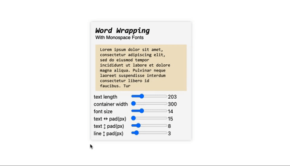

# Vega-Lite-Techniques
This is a growing compilation of some of my favorite visual techniques in [Vega-Lite](https://vega.github.io/vega-lite/). My hope is that others can learn, critique, and gain inspiration from visiting this collection.

‎ 

<code>These specifications are compatible with Deneb!</code> </h3>
<small>⤷ <em>Learn more about Deneb for Power BI [here](https://deneb-viz.github).</em></small>

‎ 

‎
## Animation - Easing Functions Visualized <small><em><code>New!</code></em></small>

 
Here you can compare different easing functions and see their respective formulas. This isn't a comprehensive list of easing functions, but these are definitely some popular ones. Special thanks to Pavithra Kodmad for writing [this excellent article](https://css-tricks.com/ease-y-breezy-a-primer-on-easing-functions/) on understanding easing! I originally [made this visual in Vega](https://github.com/Giammaria/Vega-Visuals/tree/main?tab=readme-ov-file#easing-functions-visualized) a while back. Until now, I would not have thought that this would be feasible in Vega-Lite.
|Vega-Lite|
|-|
|[Open the Chart with the Vega Editor](https://vega.github.io/editor/#/gist/f733550116a6c698adccff818b721554/spec.json/view)|
|[Open the Vega-Lite Specification](animation-easing/visualization.vl.json)|

‎ 

‎
## VConcat Visual Toggle
 
Dynamically update padding in the params array to enable toggling the visibility of visuals that are concatenated. This can be a useful technique when you want to only show one visual at a time, but also want to give the user control over which one is currently visible. This is a modification of [this example](https://vega.github.io/vega-lite/examples/vconcat_weather.html) provided on the [Vega-Lite Examples page](https://vega.github.io/vega-lite/examples/). Comments for the pertinent transforms can be found in the JSON [specification](vconcat-visual-toggle/visualization.vl.json). The input parameter has been added for demonstration purposes.
|Vega-Lite|
|-|
|[Open the Chart with the Vega Editor](https://vega.github.io/editor/#/gist/ef29b88cba26887dba012d1f72f055f7/spec.json/view)|
|[Open the Vega-Lite Specification](vconcat-visual-toggle/visualization.vl.json)|

‎

‎
## Automatic Radial Label Rotation
 
Autmatically rotate radial labels based on their theta value. Comments for the pertinent transforms can be found in the JSON [specification](automatic-radial-label-rotation/visualization.vl.json). The input parameters have been added for demonstration purposes.
|Vega-Lite|
|-|
|[Open the Chart with the Vega Editor](https://vega.github.io/editor/#/gist/da5456d90ce768f19e2cec717e8c2d38/spec.json/view)|
|[Open the Vega-Lite Specification](automatic-radial-label-rotation/visualization.vl.json)|

‎ 

‎
## Contextual Y-Axis Behavior
 
A technique to dynamically adjust the Y-axis behavior based on whether the measure is a percentage.  Comments are surrounding the <code>domainMax</code> property to make it easier to find in the JSON [specification](contextual-y-axis/visualization.vl.json). The input parameters have been added for demonstration purposes.
|Vega-Lite|
|-|
|[Open the Chart with the Vega Editor](https://vega.github.io/editor/#/gist/3fd7c2817d2cbfa8c16e155285540f09/spec.json/view)|
|[Open the Vega-Lite Specification](contextual-y-axis/visualization.vl.json)|

‎ 

‎
## Date Explosion with Sequence() & Fold
 
A demonstration combining the <code>sequence()</code> expression and the <code>fold</code> transform to explode dates. The pertinent transforms are surrounded by comments in the [specification](date-explosion/visualization.vl.json).
|Vega-Lite|
|-|
|[Open the Chart with the Vega Editor](https://vega.github.io/editor/#/gist/cf86728a68c30a903ef3fcc414d75746/spec.json/view)|
|[Open the Vega-Lite Specification](date-explosion/visualization.vl.json)|

‎ 

‎
## Dynamic Data Labels with Monospace Fonts
 
Dynamically show/hide/truncate/position data labels with monospace fonts based on their allocated space. The calculations for the labels have comments in the JSON [specification](dynamic-data-labels\visualization.vl.json). The input parameters have been added for demonstration purposes.
|Vega-Lite|
|-|
|[Open the Chart with the Vega Editor](https://vega.github.io/editor/#/gist/cbf116aabd05042e2cab5b1d5681c792/spec.json/view)|
|[Open the Vega-Lite Specification](dynamic-data-labels\visualization.vl.json)|

‎ 

‎
## Luminance() to Determine Font Color
 
Leverage the <code>luminance()</code> expression against your backgrounds to determine whether to use light or dark font colors. Comments are surrounding the luminance expression to make it easier to find in the JSON [specification](luminance/visualization.vl.json). The input parameters have been added for demonstration purposes.
<Description>
|Vega-Lite|
|-|
|[Open the Chart with the Vega Editor](https://vega.github.io/editor/#/gist/c895cb6bccd05c9a486595f4517f33de/spec.json/view)|
|[Open the Vega-Lite Specification](luminance/visualization.vl.json)|

‎ 

‎
## Use Params to Enable Light & Dark Modes
 
Use params to theme your visuals for light and dark modes. Use point selectors to toggle between the modes. Comments have been added to describe all of the params.
|Vega-Lite|
|-|
|[Open the Chart with the Vega Editor](https://vega.github.io/editor/#/gist/3e5aad3acd6e9c2a8ee12415b44636ad/spec.json/view)|
|[Open the Vega-Lite Specification](light-dark-mode\visualization.vl.json)|

‎ 

‎
## Word Wrapping with Monospace Fonts
 
Use a series of transforms to implement word wrapping with monospace fonts. The visual author should tweak the params, especially the multipliers, based on the font in use. There are a lot of steps involved, but the transforms have comments in the JSON [specification](word-wrapping/visualization.vl.json). The input parameters have been added for demonstration purposes.
|Vega-Lite|
|-|
|[Open the Chart with the Vega Editor](https://vega.github.io/editor/#/gist/9a5b588038b92c3741874bc2cc8fc86c/spec.json/view)|
|[Open the Vega-Lite Specification](word-wrapping/visualization.vl.json)|

<!--
‎ 

‎
##
 
<Description>
|Vega-Lite|
|-|
|[Open the Chart with the Vega Editor]()|
|[Open the Vega-Lite Specification]()|

-->